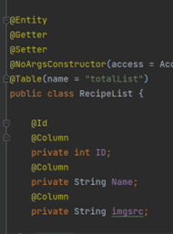

# java spring api doc

상태: 할 일
작성일시: 2023년 4월 5일 오후 2:35

# Spring- Server

### 2022~23 가천대학교 소프트웨어학과 졸업작품

## 프로젝트 배경 및 동기

- 코로나19로 인해 집밥의 수요가 증가
- 기존 레시피 어플로 레시피를 보며 요리를 할 시 터치로 제어를 해야되어 손에 있는 음식들이 스크린에 묻음

## 프로젝트 목적

- 바코드/QR코드 등을 이용해 손쉽게 제품 정보를 저장할 수 있게 함
- 냉장고 속의 식재료를 사용할 수 있는 음식 레시피를 추천해 유통기한이 임박한 재료들을 사용할 수 있도록 유도

## 개발 환경

- 메인 서버: 아직은 Local
- 
    - 서버 배포예정
- 자바 Version:JDK 17
- gradle Version : gradle-6.9
- DataBase:
    - version: MySQL 8.0.28
- 프레임워크: SpringBoot
- Tool: IntelliJ(코드 작성 IDE), PostMan(API 테스트)

## 소프트웨어 구성도

여기에 지난 발표때 사용한 ppt자료 첨부

## ERD 구성도

DB에서 entity들의 관계보여주는 uml이나 시각자료를 첨부 할 예정(회원 DB가 정립되면 update)

## 구현한 기능 목록

- 회원가입/로그인
- 회원정보 수정/삭제(탈퇴)(will be updated)
- 식재료 리스트 관리(Using jpa)
    - 레시피 불러오기
    - 레시피에 들어가는 재료 불러오기
    - 레시피 조리 순서 불러오기
    - 사용자가 작성한 레시피를 DB에 등록
- flask 챗봇 서버와의 통신
    - flask서버와 통신을해 intent를 flask서버로 전달
    - flask 서버에서 분류해준 response를 다시 app으로 전달
    - 여기에 설명을 도울 사진 추가예정

### 구현한 flask 챗봇서버와의 통신

T.B.U(

## 기능 구현(API 작성) 예시

- 만들어 놓은 화면별 프로토타입 이미지를 바탕으로 해당 화면에 필요한 정보를 입력받거나 가져올 쿼리 생성
- 작성한 쿼리를 바탕으로 SpringBoot 코드를 작성해 간단한 API 생성
- 우선 가장 기본이 되는 회원가입, 로그인 API 부터 작성
- Postman을 통해 API 작동 확인

## 1.회원가입&로그인

T.B.U

## 2.식재료 리스트 관리(Using jpa)

### 1)Entity

데이터 베이스 구조에 맞추어 3개의 레시피 데이터 엔티티를 구성함

**-food list(전체 레시피를 구성하는 용도)**



-**recipe_ingredient(전체 레시피리스트에서 선택한 레시피의 재료정보를 가지고있는 엔티티)** 


id값,재료이름,재료의 양, 선택한 레시피의 id값을 담는 총 4개의 필드로 구성

**-recipe_Cooking(전체 레시피리스트에서 선택한 레시피의 단계별 조리정보를 가지고있는 엔티티)** 


id값,해당조리단계에대한 설명,조리 단계 순서, 선택한 레시피의 id값을 담는 총 4개의 필드로 구성

### 2) 쿼리 작성(Recipedetail을 예시로)

- JPQL을 이용하여 id값을 입력 하면 해당하는 data들을 DB에서 retrieve 해줌
    
    
    

### 3) api 구현

어플리케이션 및 서버간 통신과정에서의 프로토콜을 json데이터 구조로 transfer하는 것으로 정함

**-Recipetoapp Controller**


안드로이드 app 에서 api access point를 [http://localhost:8080/](http://localhost:8080/)android/recipeCooking

으로 설정하고 parameter을 “id=1(ex) 로 설정하고 request를 보내면


위와같이 mysql로 작성된 데이터베이스에 저장되어있는 모든 레시피의 정보들을 jpa인터페이스로 가져와 아래와 같은 jsonArray형태로 리턴해 준다.

```json
{
	"recipe_list":
	[
		{"ID": "0", "Name":"라면","imgsrc":"img1"},
		{"ID": "1", "Name":"짬뽕","imgsrc":"img2"}
	]
}
```

**-다음으로 사용자가 앱에서 자신의 레시피를 등록하는 기능이다**

어플리케이션에서 사용자가 레시피를 등록할 수 있도록 API개발 하였다


사용자가 위의 화면에서 레시피의 정보들을 입력하면 어플리케이션에서 json으로 변환된 정보들이 parameter로 Access Point [http://localhost:8080/](http://localhost:8080/)android/saveRecipe 로 post요청됨


api서버로 넘겨져온 recipe정보들은 jpa인터페이스를 이용하여 데이터 베이스에저장


## 3.챗봇 서버(Python Flask 서버)와 통신 API

안드로이드 어플리케이션의 부담을 줄이기 위해 

레시피 음성제어 부분의 http 통신을

**안드로이드 어플리케이션**

```json
{”chat_request”:”1”}
```

↓

**자바 스프링 서버**

```json
{”chat_request”:”1”}
```

↓

**챗봇 서버(flask)**

---

**챗봇 서버(flask)**

```json
{"chatString":"사용자 명령어 stt 결과"}
```

↓

**자바 스프링 서버**

```json
{"chatString":"사용자 명령어 stt 결과"}
```

↓

**안드로이드 어플리케이션**

다음과 같이 구조화함

### `JsontransferController` 에서

1)Access point를 [http://localhost:8080](http://localhost:8080/)/getIntent 로 설정하고 app에서 음성을 입력한다

2)response body에 사용자가 말한 음성 string이 담겨져오고

```java
@ResponseBody
@PostMapping("")
public String flaskspring(@RequestBody String jsonString, 
HttpServletResponse response) throws ParseException, IOException
```

3)flask서버에 intent 구분 요청을 post방식으로 보낸다

```java
String flask_url = "flask 챗봇 서버 주소";//flask 서버 URL
URL url = new URL(flask_url);
HttpURLConnection con = (HttpURLConnection) url.openConnection();
```

```java
try(OutputStream os = con.getOutputStream()) {
    byte[] input = jsonString.getBytes("utf-8");    
		os.write(input, 0, input.length);
}
```

4)flask 챗봇 서버로 부터 구분된 intent를 받아오고 app에 return 해준다

```java
int responseCode = con.getResponseCode();
System.out.println("http"+"response_code : "+responseCode);
System.out.println("http"+"response : "+con.getResponseMessage());
```

```java
reader = new BufferedReader(new InputStreamReader(in));
while((line = reader.readLine())!=null){    
	result += line;
}
reader.close();
if(con !=null){
    con.disconnect();
}
return result;
```
